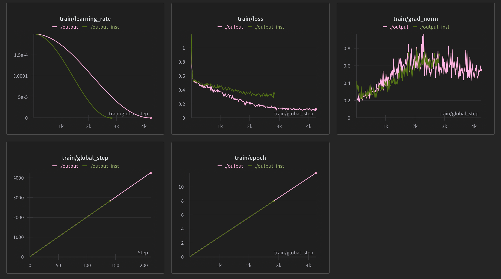

# LLM 上层设施 Langchain RAG

上一部分中，我们使用 trl 微调优化了模型的推理能力，评测的分数有了明显的提升。这一部分中，我们将首先使用 vLLM 优化模型的推理速度，然后利用 rag 技术进一步优化模型的表现。

## vLLM 使用

### vLLM 基本使用

vLLM 中最重要的两个类是`LLM`与`SamplingParams`，前者是对模型的封装，后者是对生成参数的包装。

要加载模型和生成，只需要，

```python
from vllm import LLM, SamplingParams
prompts = [
    "Hello, my name is",
    "The president of the United States is",
    "The capital of France is",
    "The future of AI is",
]
sampling_params = SamplingParams(temperature=0.8, top_p=0.95)
llm = LLM(model="facebook/opt-125m")

outputs = llm.generate(prompts, sampling_params)

# Print the outputs.
for output in outputs:
    prompt = output.prompt
    generated_text = output.outputs[0].text
    print(f"Prompt: {prompt!r}, Generated text: {generated_text!r}")
```

不过，vLLM 只对一部分模型做了优化，且目前只支持 decoder-only 的模型，因此只支持 CasualLM 任务。微调只支持 LoRA adapter。支持列表见[官方文档](https://docs.vllm.ai/en/latest/models/supported_models.html#supported-models)。此外 vLLM 只支持 linux 系统，而且通常不会和上游立即同步版本。

### langchain 使用 vLLM

使用方法相同，不过一次只能生成一个 prompt。

```python
from langchain_community.llms import VLLM

llm = VLLM(
    model="mosaicml/mpt-7b",
    trust_remote_code=True,  # mandatory for hf models
    max_new_tokens=128,
    top_k=10,
    top_p=0.95,
    temperature=0.8,
)

print(llm.invoke("What is the capital of France ?"))
```

### 使用 vLLM 加速原有代码

之前的代码如下，

```python
def get_pipeline() -> TextGenerationPipeline:
    import torch
    generator: TextGenerationPipeline =  pipeline("text-generation", model=model_path, tokenizer=model_path, device="cuda", torch_dtype=torch.bfloat16)
    from peft.config import PeftConfig
    conf = PeftConfig.from_pretrained(adapter_path)
    generator.model.add_adapter(conf)
    return generator

def generate_answer_inplace(entry: Entry, generator: TextGenerationPipeline):
    for question in entry.questions:
        got_answer = False
        attempts = 2
        while not got_answer and attempts > 0:
            prompt_template = """你是一个逻辑推理专家，擅长解决逻辑推理问题。以下是一个逻辑推理的题目，形式为单项选择题。所有的问题都是（close-world assumption）闭世界假设，即未观测事实都为假。每个问题都保证能通过一系列基于形式逻辑的推理（包括同一律，矛盾律，排中律的使用等）得到确定的答案。请逐步分析问题，写出思考过程，并在最后一行输出答案，最后一行的格式为"答案是：A"或"答案是：B"或"答案是：C"或"答案是：D"等等。题目如下：
### 题目:
{problem}

### 问题:
{question}
{options}

### 分析过程
"""
            prompt = prompt_template.format(
                **{
                    "problem": entry.problem,
                    "question": question.question,
                    "options": format_options(question.options)
                }
            )
            voter = 3
            result = generator(prompt, max_new_tokens=max_new_tokens, truncation=True, num_return_sequences=voter, do_sample=True)
            counter = {}
            with open("a.txt", "a") as f:
                f.write("\n" + prompt + "\n" + "=" * 10)
            for i in range(voter):
                raw_response = result[i]["generated_text"]
                raw_response = raw_response.removeprefix(prompt)
                raw_response = raw_response.split("---")[0]
                raw_response = raw_response.split("### 题目")[0]
                raw_response = raw_response.split("### 问题")[0]
                with open("a.txt", "a") as f:
                    f.write(f"\n voter {i}  {'=' * 10}\n{raw_response}")
                # sometimes model generates 答案：**A** and alike
                # so remove some special characters
                raw_response = raw_response.replace("*", "")
                raw_response = raw_response.replace("-", "")
                raw_response = raw_response.replace(",", "")
                raw_response = raw_response.replace("，", "")
                import re
                # print("=" * 10)
                # print(raw_response)
                # print("=" * 10)
                
                match = re.search(r"答案是：[A-Z]", raw_response)
                if match:
                    answer = match.group()
                    answer = answer.split("：")[-1]
                else:
                    answer = None
                counter[answer] = counter.get(answer, 0) + 1
            answer = max(counter, key=counter.get)
            with open("a.txt", "a") as f:
                f.write(str(counter) + "\n" + "=" * 10)
            if answer:
                question.answer = answer.split("：")[-1]
                got_answer = True
            else:
                print("Failed to find answer in response.")
                print("Setting answer to C.")
                question.answer = "C"
            attempts -= 1
```

为了方便后续做 rag，这里模版生成的时候依赖注入（~~当然原则上全都应该使用依赖注入，但是懒~~）。

下面的实现有点丑陋，工程角度上很烂，但是基本都是一次性代码所以，whatever。

```python
def get_prompts_of_entry(entry: Entry) -> list[str]:
    prompts = []
    prompt_template = """你是一个逻辑推理专家，擅长解决逻辑推理问题。以下是一个逻辑推理的题目，形式为单项选择题。所有的问题都是（close-world assumption）闭世界假设，即未观测事实都为假。每个问题都保证能通过一系列基于形式逻辑的推理（包括同一律，矛盾律，排中律的使用等）得到确定的答案。请逐步分析问题，写出思考过程，并在最后一行输出答案，最后一行的格式为"答案是：A"或"答案是：B"或"答案是：C"或"答案是：D"等等。题目如下：
### 题目:
{problem}

### 问题:
{question}
{options}

### 分析过程"""
    for question in entry.questions:
        prompt = prompt_template.format(
            **{
                "problem": entry.problem,
                "question": question.question,
                "options": format_options(question.options)
            }
        )
        prompts.append(prompt)
    return prompts

from vllm import LLM, SamplingParams
from vllm.lora.request import LoRARequest
import torch
def get_model_and_sampling() -> tuple[LLM, SamplingParams, LoRARequest]:
    llm = LLM(model_path, model_path, enable_lora=True, dtype=torch.bfloat16)
    sampling = SamplingParams(
        max_tokens=max_new_tokens,
        n=voters,
    )
    lora = LoRARequest(
        "default",
        1,
        adapter_path
    )
    return llm, sampling, lora

def get_answer_from_raw(raw) -> str:
    raw = raw.text
    raw = raw.split("---")[0]
    raw = raw.split("### 题目")[0]
    raw = raw.split("### 问题")[0]
    remove_chars = ["*", "-"]
    for char in remove_chars:
        raw = raw.replace(char, "")
    import re
    match = re.search(r"答案是：[A-Z]", raw)
    if match:
        answer = match.group()
        answer = answer.split("：")[-1]
    else:
        answer = None
    return answer

def log_file(log_content: str):
    with open("./a.txt", "a") as f:
        f.write(log_content + "\n")

def generate_answers_batch(prompts: list[str], model: LLM, sampling: SamplingParams, lora: LoRARequest) -> list[str]:
    answers_unchecked = model.generate(
        prompts,
        sampling,
        lora_request=lora
    )
    answers = []
    for one_output in answers_unchecked:
        answer = [get_answer_from_raw(r) for r in one_output.outputs]
        log_file(
            "=" * 20 + "\n" + \
            "Prompt: \n" + prompts[answers_unchecked.index(one_output)] + "\n" + \
            "=" * 20 + "\n" + \
            ("=" * 20 + "\n").join(
                [f"Output: \b{o.text}" for o in one_output.outputs]
            )
        )
        filtered_answers = [ans for ans in answer if ans is not None]
        if not filtered_answers:
            most_common_answer = None
        else:
            most_common_answer = max(set(filtered_answers), key=filtered_answers.count)
        answer = most_common_answer
        if answer is None:
            print("Failed to get answer, default to A.")
            answer = "A"
        answers.append(answer)
    return answers
        

def generate_answers_inplace(entries: list[Entry], prompts: list[list[str]], model: LLM, sampling: SamplingParams, lora: LoRARequest):
    next_entry_index = 0
    next_question_index = 0
    
    total = sum([len(entry.questions) for entry in entries])


    progress = tqdm(total=(total // batch_size + (1 if total % batch_size != 0 else 0)))
    
    while next_entry_index < len(entries):
        batch_entries = []
        batch_prompts = []
        start_index_of_first_entry_question = next_question_index
        start_index_of_first_entry = next_entry_index
        while len(batch_prompts) < batch_size and next_entry_index < len(entries):
            entry = entries[next_entry_index]
            prompt = prompts[next_entry_index][next_question_index]
            batch_entries.append(entry)
            batch_prompts.append(prompt)
            next_question_index += 1
            if next_question_index >= len(entry.questions):
                next_question_index = 0
                next_entry_index += 1
        answers = generate_answers_batch(batch_prompts, model, sampling, lora)
        
        if len(answers) != batch_size:
            print("Answers length not equal to prompt entries length.")
            print("This should not happen.")
        
        i = 0
        next_entry_to_set = start_index_of_first_entry
        next_question_to_set = start_index_of_first_entry_question
        while i < len(answers):
            entry = entries[next_entry_to_set]
            entry.questions[next_question_to_set].answer = answers[i]
            i += 1
            next_question_to_set += 1
            if next_question_to_set >= len(entry.questions):
                next_question_to_set = 0
                next_entry_to_set += 1
        progress.update()
    progress.close()

def main():
    entries = parse_file("./round1_test_data.jsonl")
    print("building db...")
    db = get_db()
    print("db built")
    print("building prompts...")
    prompts = [get_prompts_of_entry(entry, db) for entry in entries]
    # unload the embedding
    del db
    print(prompts[0])
    generator, sampling, lora = get_model_and_sampling()
    generate_answers_inplace(entries, prompts, generator, sampling, lora)
    dump_entries(entries, "./upload.jsonl")


# In[11]:


if __name__ == "__main__":
    main()
```

这样就完成了对原有代码的加速。

## RAG in Langchain

### 介绍

RAG 是指 Retrieval-Augmented Generation，是一种结合检索和生成的方法。在 RAG 中，检索模块负责从知识库中检索相关信息，生成模块负责生成答案。RAG 的优势在于，检索模块可以帮助生成模块更好地生成答案，特别是在生成长文本时。

RAG 常用的一种技术是向量相似度检索，其工作原理是通过 embedding 模型将问题和知识库中的信息映射到向量空间，然后通过计算向量之间的相似度来检索相关信息。这个过程通常使用向量数据库实现。

具体来说，在本任务中，我们会在生成 prompt 时先去向量数据库检索一个类似的题（从训练集中），然后将这个题目作为 prompt 的一部分，让模型去模仿问题的思路。

### 向量数据库的构建

先加载我们之前构建的带推理数据集。

```python
train_dataset = Dataset.load_from_disk("./train_dataset")
```

Langchain RAG 中，存储和检索基础单位是文档`Document`，我们需要将数据集中的每个问题转换为一个文档。

一般而言，会使用 document loader，例如，

```python
import bs4
from langchain_community.document_loaders import WebBaseLoader

# Only keep post title, headers, and content from the full HTML.
bs4_strainer = bs4.SoupStrainer(class_=("post-title", "post-header", "post-content"))
loader = WebBaseLoader(
    web_paths=("https://lilianweng.github.io/posts/2023-06-23-agent/",),
    bs_kwargs={"parse_only": bs4_strainer},
)
docs = loader.load()
```

不过这里我们要自己创建 Document 对象。注意，`Document`对象可以携带额外信息，但是检索是基于`page_content`，即构造器的第一个参数，进行的。这里我们以`question`字段作为相似度，因为我们希望模型去模仿一个相似问题的解答，其它的所有信息作为额外携带信息。携带信息放在`metadata`字段中。

```python
def to_doc(row: dict) -> Document:
    return Document(
        row["question"], metadata=row
    )
```

向量数据库需要一个 embedding 模型，这里使用`DMetaSoul/Dmeta-embedding-zh`。向量数据库使用 Chroma，是一个常用的内存向量数据库。

```python
def get_embedding() -> HuggingFaceEmbeddings:
    return HuggingFaceEmbeddings(model_name=embedding_path)

def get_db() -> Chroma:
    db = Chroma.from_documents(
        [to_doc(row) for row in get_dataset()],
        get_embedding()
    )
    return db
```

之后使用`db.similarity_search("选择题", k=2)`就可以拿到按相似度排序自高到低的 Document 列表，它的长度为这里的 k，可以通过 metadata 获取原始的对象。

### 在微调中引入 RAG

因为之前我们的微调没有 RAG，所以我们需要重新微调。只需要在构建的时候带上 RAG 的 Prompt。

```python
def build_prompt_no_header(x: dict) -> str:
    problem = x["problem"]
    question = x["question"]
    reasoning = x["reasoning"]
    answer = x["answer"]
    options = x["options"]
    full_text = f"""### 题目        
{problem}

### 问题
{question}
{options}

### 分析过程
{reasoning}

### 答案
答案是：{answer}"""
    return full_text

def build_prompt(x: dict, db: Chroma) -> str:
    head = r"""你是一个逻辑推理专家，擅长解决逻辑推理问题。以下是一个逻辑推理的题目，形式为单项选择题。所有的问题都是（close-world assumption）闭世界假设，即未观测事实都为假。每个问题都保证能通过一系列基于形式逻辑的推理（包括同一律，矛盾律，排中律的使用等）得到确定的答案。请逐步分析问题，写出思考过程，并在最后一行输出答案，最后一行的格式为"答案是：A"或"答案是：B"或"答案是：C"或"答案是：D"等等。如果你做对了这个题目，你会获得的一亿奖金。"""
    tops = db.similarity_search(
        x["question"],
        k=3,
    )
    # the first is guaranteed to be the same as the input
    first_top = tops[1]
    second_top = tops[2]
    full = f"""{head}
这是一个例子：
{build_prompt_no_header(first_top.metadata)}

这是另一个例子：
{build_prompt_no_header(second_top.metadata)}

现在，你需要解决这个问题：
{build_prompt_no_header(x)}"""
    return full

def finetune():
    from accelerate import Accelerator
    acc = Accelerator()
    from accelerate.accelerator import AcceleratorState
    AcceleratorState().deepspeed_plugin.deepspeed_config['train_micro_batch_size_per_gpu'] = micro_batch
    model, tokenizer = get_model_and_tokenizer()
    train_dataset = Dataset.load_from_disk("./train_dataset")
    db = get_db()
    def encode(x):
        encoded = tokenizer(build_prompt(x, db) + tokenizer.eos_token, max_length=max_new_tokens, truncation=True, pad_to_multiple_of=8)
        encoded["labels"] = encoded["input_ids"].copy()
        return encoded
    train_dataset = train_dataset.map(
        lambda x: encode(x),
        batched=False
    ).remove_columns(['problem', 'question', 'options', 'reasoning', 'answer'])
    model, train_dataset = acc.prepare(
        model, train_dataset
    )
    peft_config = get_peft_config()
    training_args = get_training_args()
    trainer = SFTTrainer(
        model=model,
        args=training_args,
        train_dataset=train_dataset,
        tokenizer=tokenizer,
        peft_config=peft_config,
    )
    trainer.train()
    trainer.save_model(output_path)
```

训练过程 logging 如下，



其中，绿色的部分是不带 RAG 的微调，即上一个部分的内容，粉红色的部分是带 RAG 的微调。

可以看到，带 RAG 的训练 loss 下降明显比不带 RAG 快的多。

此外本次训练中增加 epoch 至 12。

### 在推理中引入 RAG

同样的，只需要修改 Prompt 的生成方式。

```python
def build_prompt_no_header(x: dict) -> str:
    problem = x["problem"]
    question = x["question"]
    reasoning = x["reasoning"]
    answer = x["answer"]
    options = x["options"]
    full_text = f"""### 题目        
{problem}

### 问题
{question}
{options}

### 分析过程
{reasoning}

### 答案
答案是：{answer}"""
    return full_text

def build_prompt(x: dict, db: Chroma) -> str:
    head = r"""你是一个逻辑推理专家，擅长解决逻辑推理问题。以下是一个逻辑推理的题目，形式为单项选择题。所有的问题都是（close-world assumption）闭世界假设，即未观测事实都为假。每个问题都保证能通过一系列基于形式逻辑的推理（包括同一律，矛盾律，排中律的使用等）得到确定的答案。请逐步分析问题，写出思考过程，并在最后一行输出答案，最后一行的格式为"答案是：A"或"答案是：B"或"答案是：C"或"答案是：D"等等。如果你做对了这个题目，你会获得的一亿奖金。"""
    tops = db.similarity_search(
        x["question"],
        k=2,
    )
    first_top = tops[0]
    second_top = tops[1]
    full = f"""{head}
这是一个例子：
{build_prompt_no_header(first_top.metadata)}

这是另一个例子：
{build_prompt_no_header(second_top.metadata)}

现在，你需要解决这个问题：
### 题目
{x["problem"]}

### 问题
{x["question"]}
{x["options"]}

### 分析过程"""
    return full
```

为了提高准确率，投票路数增加至 4。

由于增长了文本长度，因此可以开量化来加速。这里使用较为激进的`fp8`。

```python
def get_model_and_sampling() -> tuple[LLM, SamplingParams, LoRARequest]:
    llm = LLM(model_path, model_path, enable_lora=True, quantization="fp8", gpu_memory_utilization=0.8)
    sampling = SamplingParams(
        max_tokens=max_new_tokens,
        n=voters,
    )
    lora = LoRARequest(
        "default",
        1,
        adapter_path
    )
    return llm, sampling, lora
```

量化的参数可参考 vLLM [文档](https://docs.vllm.ai/en/latest/quantization/supported_hardware.html)。

