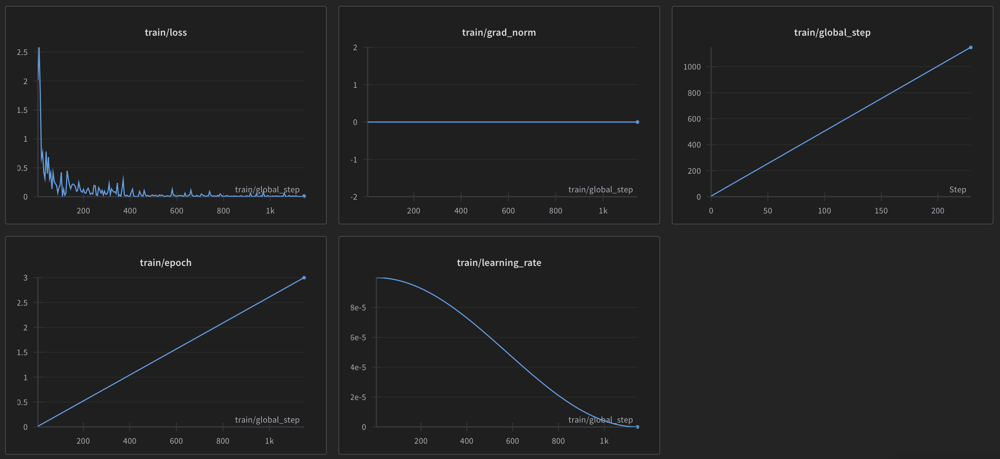
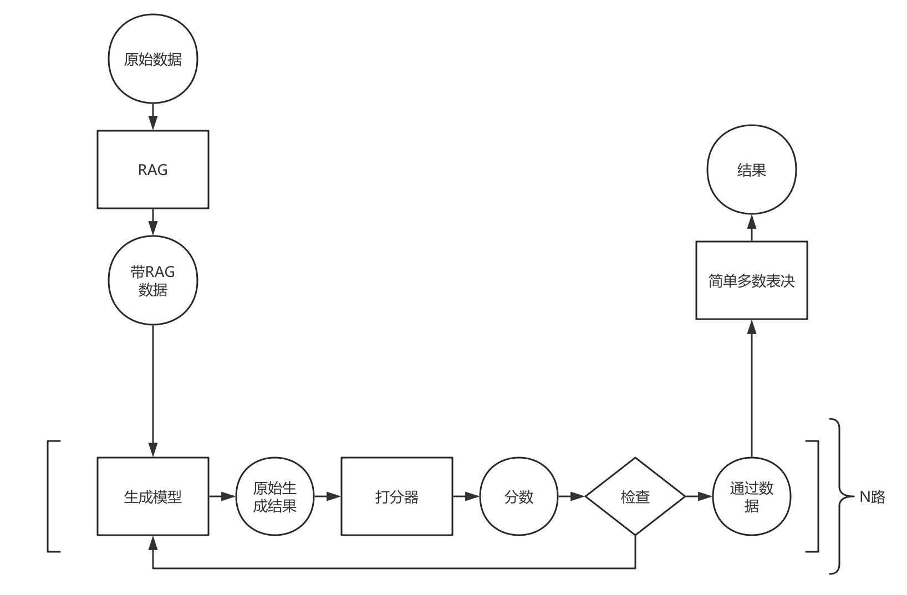

# LLM 上层设施 增强生成

前面几部分中，我们逐次利用了微调、RAG、多路投票技术来提升生成模型的性能。除了微调意外，RAG 和多路投票都称为增强生成技术（Augmented Generation）。AG 是指在生成模型的基础上，通过引入额外的信息或者技术，来提升生成模型的性能。在这一部分，我们将介绍并使用几种常见的 AG 技术，包括已经使用的 RAG 和多路投票，以及将要介绍的重采样技术与数据增强技术。

## 数据增强技术

数据增强技术是指通过对原始数据进行一系列变换，来生成新的数据。数据增强技术可以提升生成模型的性能，因为生成模型在训练时可以看到更多的数据，从而提升泛化能力。常见的数据增强技术包括，使用同义词替换；使用大模型生成数据；使用机器翻译生成数据。

同义词替换顾名思义，就是将原始数据中的某些词替换为其同义词。这种方法可以提升生成模型的泛化能力，因为生成模型在训练时可以看到更多的数据。

使用大模型生成数据是指使用大模型根据已有数据生成新的数据，然后供较小的模型训练（当然，也可以用较小的模型生成，但效果不好）。这种方法可以提升生成模型的性能，因为大模型可以生成更多的数据，从而提升泛化能力。然而，由于幻觉问题，生成的数据可能不符合预期，需要进行清洗，正确性也存疑。

机器翻译生成数据类似于同义词替换，不过是先把数据翻译成另一种语言，然后再翻译回来。这种方法可以提升生成模型的泛化能力，因为生成模型在训练时可以看到更多的数据。这样的数据比起用大模型生成的数据更加可靠。

这里我们使用腾讯翻译的 api。

```python
def translate(text: list[str], trans_back=False) -> list[str]:
    from tencentcloud.common import credential
    from tencentcloud.tmt.v20180321 import tmt_client, models
    import os
    cred = credential.Credential(
        os.getenv("TENCENT_SECRET_ID"),
        os.getenv("TENCENT_SECRET_KEY")
    )
    from tencentcloud.common.profile.client_profile import ClientProfile
    from tencentcloud.common.profile.http_profile import HttpProfile
    httpProfile = HttpProfile()
    httpProfile.endpoint = "tmt.tencentcloudapi.com"
    clientProfile = ClientProfile()
    clientProfile.httpProfile = httpProfile
    client = tmt_client.TmtClient(cred, "ap-beijing", clientProfile)
    request = models.TextTranslateBatchRequest()
    params = {
        "Source": "zh" if not trans_back else "ja",
        "Target": "ja" if not trans_back else "zh",
        "ProjectId": 0,
        "SourceTextList": text
    }
    import json
    request.from_json_string(json.dumps(params))
    response = client.TextTranslateBatch(request)
    return json.loads(response.to_json_string())["TargetTextList"]

def translate_entries_inplace(entries: list[Entry], trans_back=False):
    problems = [entry.problem for entry in entries]
    translated_problems = translate(problems, trans_back)
    for entry, translated_problem in zip(entries, translated_problems):
        entry.problem = translated_problem
    reasoning_flat = [
        question.reasoning
        for entry in entries
        for question in entry.questions
    ]
    translated_reasoning = translate(reasoning_flat, trans_back)
    reasoning_idx = 0
    for entry in entries:
        for question in entry.questions:
            question.reasoning = translated_reasoning[reasoning_idx]
            reasoning_idx += 1
    options_flat = [
        option
        for entry in entries
        for question in entry.questions
        for option in question.options
    ]
    translated_options = translate(options_flat, trans_back)
    options_idx = 0
    for entry in entries:
        for question in entry.questions:
            question.options = translated_options[options_idx:options_idx+len(question.options)]
            options_idx += len(question.options)
    questions_flat = [
        question.question
        for entry in entries
        for question in entry.questions
    ]
    translated_questions = translate(questions_flat, trans_back)
    questions_idx = 0
    for entry in entries:
        for question in entry.questions:
            question.question = translated_questions[questions_idx]
            questions_idx += 1

batch = 5
for i in tqdm(range(0, len(export_entries_translated), batch)):
    from_idx =i
    to_idx = min(i + batch, len(export_entries_translated))
    translate_entries_inplace(export_entries_translated[from_idx:to_idx])
    translate_entries_inplace(export_entries_translated[from_idx:to_idx], True)
```

这样我们的数据量就翻倍了。不过，我们需要在翻译时去掉翻译类的任务，因为这样的任务翻译后可能会有歧义；在 RAG 时，也不要使用扩展的数据，因为这样子，相似度搜索可能会获得多个相同的问题。

此外，instruct 不用翻译，至翻译问题，选项和推理。

## 重采样技术

重采样又称拒绝采样，是一种用于生成模型的采样技术。该种技术是指，当生成模型生成的结果不符合预期时，拒绝该结果并重新生成。常用的方法是打分器。多路投票也可以看作是一种重采样技术。

打分器是一种用于评估生成结果的技术。在生成模型生成结果后，打分器会对结果进行评分，如果结果不符合预期，则拒绝该结果并重新生成。打分器的设计是一个重要的问题，一个好的打分器可以提升生成模型的性能。

这里我们使用一个小模型进行全量训练作为打分器。

这次我们使用 Qwen2 0.5B 模型进行全量训练，用于打分器。如果输入的推理是正确的，那么打分器的输出 1，否则输出 0。

### 数据准备

之前我们已经生成好了正确的推理数据，然后我们需要一些错误的推理数据。

这一过程很简单：把我们生成推理数据的 Prompt 的答案改为错误的答案，然后重新生成推理数据，大模型会因为幻觉而进行错误的推理。

因为本来想要的数据就是错误的，所以我们使用一个小模型即可，这里可以用免费 qwen1.5-0.5b-chat 模型。

之前虽然生成好了正确的推理数据，为了提高数据的质量，我们用百度千帆提供的 Yi-34B-Chat（免费但有每日配额）和 Qianfan-Chinese-Llama-2-13B 重新生成一遍。这些模型参数量更大，因此生成的推理数据质量更高。

```python
def generate_reasoning_inplace(entries: list[Entry]) -> None:
    template = """你是一个逻辑推理专家，擅长解决逻辑推理问题。以下是一个逻辑推理的题目，形式为单项选择题。所有的问题都是（close-world assumption）闭世界假设，即未观测事实都为假。每个问题都保证能通过一系列基于形式逻辑的推理（包括同一律，矛盾律，排中律的使用等）得到确定的唯一答案。我会向你提供答案，而你要给出逐步的解析来教会我如何得到答案。我是一个小学生，所以每一步的推理不要太复杂。
{problem}

### 问题
{question}
{options}

### 答案
{answer}

### 分析过程"""
    import time
    import qianfan
    client = qianfan.ChatCompletion(model="Qianfan-Chinese-Llama-2-13B")
    progress_q = tqdm(total=sum([len(entry.questions) for entry in entries]))
    import re
    answer_regex = re.compile(r"答案.*?([A-Z])")
    def process_question(entry, question):
        if question.reasoning is not None:
            matches = answer_regex.findall(question.reasoning)
            answer = matches[-1] if len(matches) > 0 else None
            if answer == None:
                with open("./a.txt", "a") as f:
                    f.write("1\n")
                    f.write(question.reasoning)
                progress_q.update(1)
                return
            if answer != question.answer:
                print(f"答案不匹配: {answer} != {question.answer}")
            else:
                progress_q.update(1)
                return
        max_retries = 3
        for attempt in range(max_retries):
            try:
                reasoning_prompt = template.format(**{
                    "problem": entry.problem,
                    "question": question.question,
                    "options": format_options(question.options),
                    "answer": question.answer
                })
                from qianfan import QfResponse
                resp = client.do([{
                    "role": "user",
                    "content": reasoning_prompt
                }])
                question.reasoning = resp.body["result"]
                # 答案是 [A-Z]
                import re
                matches = answer_regex.findall(question.reasoning)
                answer = matches[-1] if len(matches) > 0 else None 
                if answer is None:
                    break
                if answer != question.answer:
                    print(f"答案不匹配: {answer} != {question.answer}")
                    # Retry
                    continue
                with open("reasoning.txt", "a") as f:
                    f.write(f"{reasoning_prompt}\n\n{question.reasoning}\n\n")
                break  # Exit the loop if successful
            except Exception as e:
                if attempt < max_retries - 1:
                    time.sleep(1)  # Optional: wait a bit before retrying
                else:
                    print(f"Failed to process question.")
                    print(str(e))
        progress_q.update(1)

    with ThreadPoolExecutor(max_workers=1) as executor:
        futures = []
        for entry in tqdm(entries):
            for question in entry.questions:
                futures.append(executor.submit(process_question, entry, question))
        
        for future in futures:
            future.result()
    progress_q.close()
```

此外，还有一点要注意，有时候模型的推理给出的答案与我们输入的答案不一致，而且这样的错误数据较多，这样自我们就强迫模型重新生成，至答案一致为止，如果实在得不到正确推理就把它剔除。我们使用简单的正则表达式来提取答案。

```python
import re
answer_regex = re.compile(r"答案.*?([A-Z])")
export_entries = []
for entry in entries:
    export_questions = []
    for question in entry.questions:
        if question.reasoning is None:
            continue
        matches = answer_regex.findall(question.reasoning)
        answer = matches[-1] if len(matches) > 0 else None
        if answer is None:
            continue
        if answer != question.answer:
            print(f"答案不匹配: {answer} != {question.answer}")
            continue
        export_questions.append(QuestionItem(
            question=question.question, options=question.options, reasoning=question.reasoning, answer=answer
        ))
    export_entries.append(Entry(problem=entry.problem, questions=export_questions))
```

之后导出数据即可。

### 训练

这一次我们使用全量训练。因为模型很小，所以显存占用可以接受。此外，我们还可以使用 lomo 优化器，可参考[这个文档](https://huggingface.co/docs/transformers/main/en/trainer#lomo-optimizer)。


```python
#!/usr/bin/env python
# coding: utf-8

# In[1]:


from transformers import Qwen2ForSequenceClassification
from transformers import Qwen2TokenizerFast
import torch
from datasets import Dataset
from dataclasses import dataclass, field


# In[2]:


model_path = "./Qwen2-0.5B"
max_length = 512
output_dir = "./scorer_output"


# In[3]:


def get_model_and_tokenizer() -> tuple[Qwen2ForSequenceClassification, Qwen2TokenizerFast]:
    model = Qwen2ForSequenceClassification.from_pretrained(
        model_path,
        num_labels=2,
    )
    tokenizer: Qwen2TokenizerFast = Qwen2TokenizerFast.from_pretrained(model_path)
    model.config.pad_token_id = tokenizer.eos_token_id
    return model, tokenizer


# In[4]:


@dataclass
class QuestionItem:
    question: str
    options: list[str]
    reasoning: str | None = field(default=None)
    answer: str | None = field(default=None)

@dataclass
class Entry:
    problem: str = field(default="")
    questions: list[QuestionItem] = field(default_factory=list)


# In[5]:


def get_train_dataset() -> Dataset:
    import pickle
    entries = pickle.load(open("./entries.pkl", "rb"))
    entries_false = pickle.load(open("./entries_false.pkl", "rb"))
    entries_aug = pickle.load(open("./entries_aug.pkl", "rb"))
    entries_aug_false = pickle.load(open("./entries_aug_false.pkl", "rb"))
    dataset = []
    for entry in (entries + entries_aug):
        for question in entry.questions:
            label = 1
            dataset.append({
                "reasoning": question.reasoning,
                "labels": label
            })
    for entry in (entries_false + entries_aug_false):
        for question in entry.questions:
            label = 0
            dataset.append({
                "reasoning": question.reasoning,
                "labels": label
            })
    return Dataset.from_list(dataset).shuffle(seed=42)


# In[6]:


def encode_dataset(dataset: Dataset, tokenizer: Qwen2TokenizerFast) -> Dataset:
    def encode(examples):
        encoded = tokenizer(
            examples["reasoning"],
            pad_to_multiple_of=8,
            max_length=max_length,
            truncation=True
        )
        return encoded
    return dataset.map(encode, batched=True).remove_columns(["reasoning"])


# In[7]:


import os
os.environ["WANDB_PROJECT"] = "fine-tune-logic-inference-scorer"


# In[8]:


from trl.trainer import SFTTrainer, SFTConfig
from transformers import TrainingArguments

def get_config() -> SFTConfig:
    return SFTConfig(
        output_dir=output_dir,
        num_train_epochs=3,
        learning_rate=1e-4,
        logging_steps=5,
        seed=42,
        optim="lomo",
        lr_scheduler_type="cosine",
        report_to="wandb",
    )


# In[9]:


def train():
    from accelerate import Accelerator
    acc = Accelerator()
    model, tokenizer = get_model_and_tokenizer()
    train_dataset = get_train_dataset()
    train_dataset = encode_dataset(train_dataset, tokenizer)
    model, tokenizer, train_dataset = acc.prepare(model, tokenizer, train_dataset)
    config = get_config()
    from transformers import DataCollatorWithPadding
    trainer = SFTTrainer(
        model=model,
        args=config,
        train_dataset=train_dataset,
        data_collator=DataCollatorWithPadding(tokenizer),
    )
    trainer.train()
    trainer.save_model("model")


# In[10]:


if __name__ == "__main__":
    train()


```

训练过程中，显示 grad_norm 为 0 是正常的，因为 lomo 优化器会卸载梯度，因此不会计算梯度的范数。只要 loss 能降到 0.6 以下（因为是 2 分类问题，random guess 的交叉熵损失是 $ 2log2 $），就说明是正常的。



### 使用打分器

使用打分器也很简单，只需要加载模型，然后输入推理即可。

```python
def score_reasoning(reasoning: list[str], scorer: Qwen2ForSequenceClassification, tokenizer: Qwen2TokenizerFast) -> list[float]:
    encoded = tokenizer(reasoning, padding=True, truncation=True, max_length=max_length, return_tensors="pt").to("cuda")
    with torch.no_grad():
        logits = scorer(**encoded).logits
    return logits.argmax(dim=-1).detach().cpu().numpy().tolist()
```

## 推理代码

下面的代码有大量的 monkey patch，但是能跑就好。

流程图如下，



用新的数据重新走完微调、推理流程，即可获得新的结果。

```python
#!/usr/bin/env python
# coding: utf-8

# In[1]:


import warnings

warnings.simplefilter("ignore")


# In[2]:


from transformers import AutoModelForCausalLM, Qwen2TokenizerFast, Qwen2ForSequenceClassification
from dataclasses import dataclass, field
from langchain_core.prompts import ChatPromptTemplate
from tqdm import tqdm
from datasets import Dataset
from langchain_core.documents import Document
from langchain_chroma import Chroma
from langchain_huggingface import HuggingFaceEmbeddings

embedding_path = "./Dmeta-embedding-zh"
def get_dataset() -> Dataset:
    train_dataset = Dataset.load_from_disk("./train_dataset")
    return train_dataset
def to_doc(row: dict) -> Document:
    return Document(
        row["question"], metadata=row
    )
def get_embedding() -> HuggingFaceEmbeddings:
    return HuggingFaceEmbeddings(model_name=embedding_path)
def get_db() -> Chroma:
    db = Chroma.from_documents(
        [to_doc(row) for row in get_dataset()],
        get_embedding()
    )
    return db


def get_scorer() -> Qwen2ForSequenceClassification:
    m = Qwen2ForSequenceClassification.from_pretrained("./scorer", device_map="auto", num_labels=2)
    return m


# In[3]:


model_path = "./qwen2-7b-instruct"
adapter_path = "./output"
max_new_tokens = 1024
max_length = max_new_tokens
batch_size = 16
voters = 5

def score_reasoning(reasoning: list[str], scorer: Qwen2ForSequenceClassification, tokenizer: Qwen2TokenizerFast) -> list[float]:
    encoded = tokenizer(reasoning, padding=True, truncation=True, max_length=max_length, return_tensors="pt").to("cuda")
    with torch.no_grad():
        logits = scorer(**encoded).logits
    return logits.argmax(dim=-1).detach().cpu().numpy().tolist()

# In[4]:

# In[5]:


import json

class EntryEncoder(json.JSONEncoder):
    def default(self, obj):
        if isinstance(obj, Entry):
            return obj.__dict__
        if isinstance(obj, QuestionItem):
            return obj.__dict__
        if isinstance(obj, str):
            return obj
        return super().default(obj)

@dataclass
class QuestionItem:
    question: str
    options: list[str]
    answer: str | None = field(default=None)

@dataclass
class Entry:
    problem: str = field(default="")
    questions: list[QuestionItem] = field(default_factory=list)
    id: str = field(default="")


# In[6]:


def parse_file(file_path: str) -> list[Entry]:
    with open(file_path, "r") as f:
        lines = f.readlines()
    entries = []
    import json
    for line in lines:
        entry = json.loads(line)
        questions = []
        for question in entry["questions"]:
            questions.append(QuestionItem(**question))
        entries.append(Entry(problem=entry["problem"], questions=questions, id=entry["id"]))
    return entries


# In[7]:


def format_options(options):
    return '\n'.join(
        [
            f'{chr(ord("A") + i)}: {option}'
            for i, option in enumerate(options)
        ]
    )


# In[8]:


# In[9]:


def dump_entries(entries: list[Entry], file_path: str):
    import json
    with open(file_path, "w") as f:
        for entry in entries:
            f.write(json.dumps(entry, cls=EntryEncoder, ensure_ascii=False) + "\n")

def build_prompt_no_header(x: dict) -> str:
    problem = x["problem"]
    question = x["question"]
    reasoning = x["reasoning"]
    answer = x["answer"]
    options = x["options"]
    full_text = f"""### 题目        
{problem}

### 问题
{question}
{options}

### 分析过程
{reasoning}

### 答案
答案是：{answer}"""
    return full_text

def build_prompt(x: dict, db: Chroma) -> str:
    head = r"""你是一个逻辑推理专家，擅长解决逻辑推理问题。以下是一个逻辑推理的题目，形式为单项选择题。所有的问题都是（close-world assumption）闭世界假设，即未观测事实都为假。每个问题都保证能通过一系列基于形式逻辑的推理（包括同一律，矛盾律，排中律的使用等）得到确定的答案。请逐步分析问题，写出思考过程，并在最后一行输出答案，最后一行的格式为"答案是：A"或"答案是：B"或"答案是：C"或"答案是：D"等等。如果你做对了这个题目，你会获得的一亿奖金。"""
    tops = db.similarity_search(
        x["question"],
        k=2,
    )
    first_top = tops[0]
    second_top = tops[1]
    full = f"""{head}
这是一个例子：
{build_prompt_no_header(first_top.metadata)}

这是另一个例子：
{build_prompt_no_header(second_top.metadata)}

现在，你需要解决这个问题：
### 题目
{x["problem"]}

### 问题
{x["question"]}
{x["options"]}

### 分析过程"""
    return full

def get_prompts_of_entry(entry: Entry, db: Chroma) -> list[str]:
    prompts = []
    for question in entry.questions:
        prompt = build_prompt({
            "problem": entry.problem,
            "question": question.question,
            "options": format_options(question.options)
        }, db)
        prompts.append(prompt)
    return prompts

from vllm import LLM, SamplingParams
from vllm.lora.request import LoRARequest
import torch
def get_model_and_sampling() -> tuple[LLM, SamplingParams, LoRARequest]:
    llm = LLM(model_path, model_path, enable_lora=True, quantization="fp8", gpu_memory_utilization=0.7)
    sampling = SamplingParams(
        max_tokens=max_new_tokens,
        n=voters,
    )
    lora = LoRARequest(
        "default",
        1,
        adapter_path
    )
    return llm, sampling, lora

def get_answer_from_raw(raw) -> str:
    raw = raw
    raw = raw.split("---")[0]
    raw = raw.split("### 题目")[0]
    raw = raw.split("### 问题")[0]
    remove_chars = ["*", "-"]
    for char in remove_chars:
        raw = raw.replace(char, "")
    import re
    match = re.search(r"答案是：[A-Z]", raw)
    if match:
        answer = match.group()
        answer = answer.split("：")[-1]
    else:
        answer = None
    return answer

def log_file(log_content: str):
    with open("./a.txt", "a") as f:
        f.write(log_content + "\n")

def generate_answers_batch(prompts: list[str], model: LLM, sampling: SamplingParams, lora: LoRARequest, scorer: Qwen2ForSequenceClassification, tokenizer: Qwen2TokenizerFast) -> list[str]:
    answers_unchecked = [[""] * voters for _ in range(len(prompts))]
    scores = [0] * len(prompts)
    resample_times = 0
    max_resample = 5
    while not all([s == 1 for s in scores]) and resample_times < max_resample:
        resample_times += 1
        need_resample = [
            i for i in range(len(prompts)) if scores[i] == 0
        ]
        resample_prompts = [prompts[i] for i in need_resample]
        resampled_responses = model.generate(
            resample_prompts,
            sampling,
            lora_request=lora
        )
        resampled_answers = [
            [
                o.text for o in r.outputs
            ] 
            for r in resampled_responses
        ]
        resampled_scores = [
            score_reasoning(ans, scorer, tokenizer)
            for ans in resampled_answers
        ]
        for i in range(len(resampled_answers)):
            for j in range(len(resampled_answers[i])):
                answers_unchecked[need_resample[i]][j] = resampled_answers[i][j]
        # remove answers that are not valid
        for i in range(len(resampled_scores)):
            for j in range(len(resampled_scores[i])):
                if resampled_scores[i][j] != 1:
                    answers_unchecked[need_resample[i]][j] = ""
        # choose the max score of each set of reasoning
        resampled_scores = [max(s) for s in resampled_scores]
        scores = [1] * len(prompts)
        for i in range(len(need_resample)):
            scores[need_resample[i]] = resampled_scores[i]
        

    
    answers = []
    for one_output in answers_unchecked:
        answer = [get_answer_from_raw(r) for r in one_output]
        log_file(
            "=" * 20 + "\n" + \
            "Prompt: \n" + prompts[answers_unchecked.index(one_output)] + "\n" + \
            "=" * 20 + "\n" + \
            ("=" * 20 + "\n").join(
                [f"Output: \b{o}" for o in one_output]
            )
        )
        filtered_answers = [ans for ans in answer if ans is not None]
        if not filtered_answers:
            most_common_answer = None
        else:
            most_common_answer = max(set(filtered_answers), key=filtered_answers.count)
        answer = most_common_answer
        if answer is None:
            print("Failed to get answer, default to A.")
            answer = "A"
        answers.append(answer)
    return answers
        

def generate_answers_inplace(entries: list[Entry], prompts: list[list[str]], model: LLM, sampling: SamplingParams, lora: LoRARequest, scorer: Qwen2ForSequenceClassification, tokenizer: Qwen2TokenizerFast):
    next_entry_index = 0
    next_question_index = 0
    total = sum([len(entry.questions) for entry in entries])


    progress = tqdm(total=(total // batch_size + (1 if total % batch_size != 0 else 0)))
    
    while next_entry_index < len(entries):
        batch_entries = []
        batch_prompts = []
        start_index_of_first_entry_question = next_question_index
        start_index_of_first_entry = next_entry_index
        while len(batch_prompts) < batch_size and next_entry_index < len(entries):
            entry = entries[next_entry_index]
            prompt = prompts[next_entry_index][next_question_index]
            batch_entries.append(entry)
            batch_prompts.append(prompt)
            next_question_index += 1
            if next_question_index >= len(entry.questions):
                next_question_index = 0
                next_entry_index += 1
        answers = generate_answers_batch(batch_prompts, model, sampling, lora, scorer, tokenizer)
        
        if len(answers) != batch_size:
            print("Answers length not equal to prompt entries length.")
            print("This should not happen.")
        
        i = 0
        next_entry_to_set = start_index_of_first_entry
        next_question_to_set = start_index_of_first_entry_question
        while i < len(answers):
            entry = entries[next_entry_to_set]
            entry.questions[next_question_to_set].answer = answers[i]
            i += 1
            next_question_to_set += 1
            if next_question_to_set >= len(entry.questions):
                next_question_to_set = 0
                next_entry_to_set += 1
        progress.update()
    progress.close()
        

# In[10]:

def get_tokenizer() -> Qwen2TokenizerFast:
    return Qwen2TokenizerFast.from_pretrained(model_path)

def main():
    entries = parse_file("./round1_test_data.jsonl")
    print("building db...")
    db = get_db()
    print("db built")
    print("building prompts...")
    prompts = [get_prompts_of_entry(entry, db) for entry in entries]
    # unload the embedding
    del db
    print(prompts[0])
    generator, sampling, lora = get_model_and_sampling()
    scorer = get_scorer()
    tokenizer = get_tokenizer()
    generate_answers_inplace(entries, prompts, generator, sampling, lora, scorer, tokenizer)
    dump_entries(entries, "./upload.jsonl")


# In[11]:


if __name__ == "__main__":
    main()
```

## 总结

在这一部分中，我们介绋了数据增强技术和重采样技术，并使用了这两种技术来提升生成模型的性能。数据增强技术可以提升生成模型的泛化能力，重采样技术可以提升生成模型的性能。在实际应用中，我们可以根据具体的任务和数据集来选择合适的增强技术。

不过最后这个打分器的效果不是很好，应该多给一些数据，或者使用更大的模型。不过，这种机制在某些场景下是有用的。

对于逻辑推理问题，最好还可以引用逻辑链（chain of thoughts）来生成推理过程，这样可以更好地理解推理过程。不过，由于我们使用的 instruct 模型而非 chat 模型，因此无法生成逻辑链。
